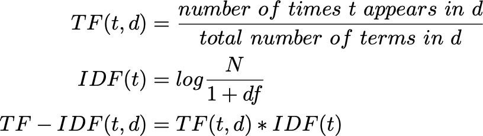

# Simplified Search Engine

This project is a simplified search engine implemented in C++, showcasing key concepts such as tokenization, XML parsing, indexing, and term frequency calculations. It also includes a web server to handle frontend requests, enabling query-based search functionality.

## Features

- **Tokenization**: Processes input text into individual tokens for efficient analysis.
- **XML Parser**: Parses XML documents to extract content for indexing.
- **Indexing**: Saves the processed data into an index stored in a JSON file.
- **Search Core**: Handles search queries and calculates document relevance based on term frequency.
- **Web Server**: Receives queries from the frontend and returns a ranked list of documents.

## Getting Started

### Prerequisites

- C++ compiler (`g++`)
- JSON library for C++ (`nlohmann/json`)
- Standard build tools (`bash`)

### Building the Project

To build the project, run the provided `build.sh` script:

```bash
./build.sh
```

This will compile the necessary files and prepare the project for execution.

### Running the Project

The project provides two main modes of operation:

1. **Indexing Mode**: Indexes the documents for search.
2. **Server Mode**: Starts the web server to handle frontend queries.

#### Indexing Mode

Use the following command to index the documents (XML):

```bash
./run.sh indexing
```

The generated index will be saved in a JSON file for future use.

#### Server Mode

Start the web server with the following command:

```bash
./run.sh server
```

The server will listen for queries from the frontend, process them through the search core, and return ranked results.

### Directory Structure

```
.
├── src/            # Source code files
├── include/        # Header files
├── files/           # XML files to be indexed
├── index.json      # Generated index (output of indexing)
├── build.sh        # Build script
├── run.sh          # Run script
└── README.md       # Project documentation
```

## Example Workflow

1. **Build the Project**:  
   ```bash
   ./build.sh
   ```

2. **Index the Documents**:  
   ```bash
   ./run.sh indexing
   ```

3. **Run the Server**:  
   ```bash
   ./run.sh server
   ```

4. **Use the frontend to query the server and retrieve ranked documents.**

## Example Files
The example documents in the files/ folder are sourced from the C++ documentation (must unzip). These XML files serve as a reference for testing and exploring the search engine's capabilities.

## Reference

https://en.wikipedia.org/wiki/Tf%E2%80%93idf

